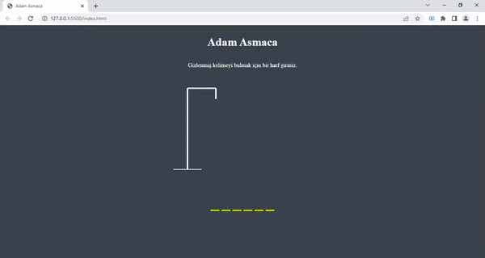

<h1> Adam Asmaca Oyunu</h1>

<h3>Javascript Dinamik Uygulama</h3>

Browser üzerinde klavyeden girilen harf değerlerine göre ve her yanlış harfde adam şeklinin
    belirli sıraya göre oluşması sonucunda kelimenin bilinmesi halinde oyunun kazanılması istenilen
    durumda tekrar oynamaya imkan tanıyan eğlenceli bir dinamik uygulama.

<h6>Puan tablosu üzerinde çalışırlmaktadır.</h6>

